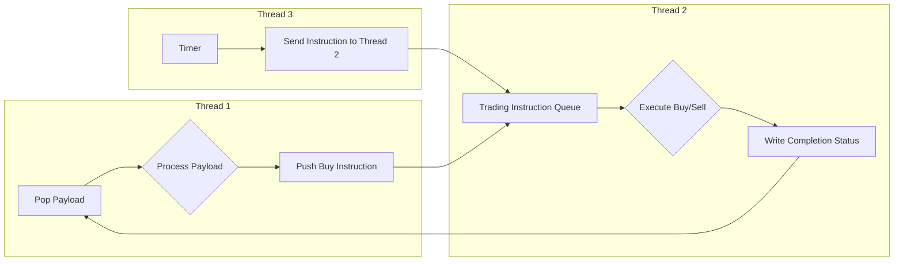

### Trading Framework

#### Thread 1
* pop payload from thread 1 message queue
* Process payload data in a loop
* Push buy instructions to thread 2 message queue

#### Thread 2:
* Maintain trading instruction queue, support multi-threaded execution of buy and sell subtasks
* Must not crash
* After executing buy instruction, write completion status to thread 1 message queue

#### Thread 3:
* Timer
* Receive initial event, wait for specified time, then send instruction to Thread 2

Trading Workflow Diagram

